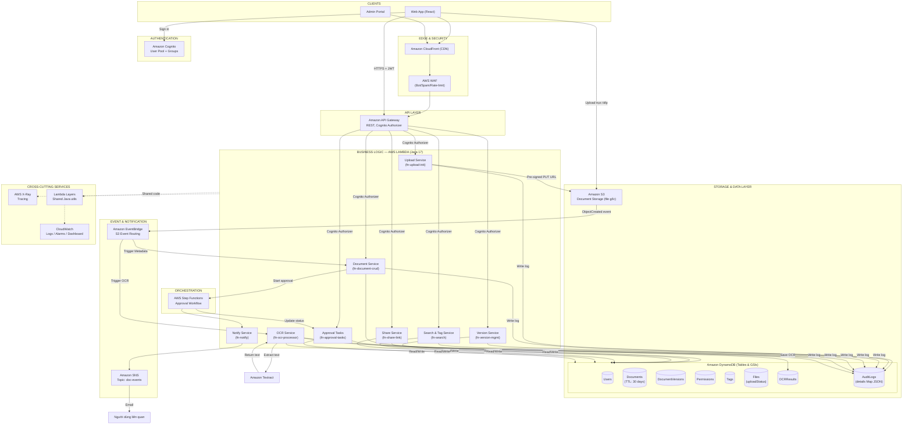

# Enterprise Document Management System (EDMS) — Serverless trên AWS

## Lộ trình triển khai dự án / Project Implementation Roadmap

**Tác giả / Author:** Đỗ Bá Sơn
**Vai trò giả định / Assumed role:** Fullstack Engineer
**Ngày / Date:** 26/07/2026
**Phiên bản / Version:** 2.0 (Cập nhật theo Business.docx)

---

## Mục lục / Table of Contents

1. [Ý tưởng &amp; Mục tiêu / Idea &amp; Objectives](#1-ý-tưởng--mục-tiêu--idea--objectives)
2. [Kiến trúc &amp; Kỹ thuật / Architecture &amp; Technical Design](#2-kiến-trúc--kỹ-thuật--architecture--technical-design)
3. [Ánh xạ chức năng → Dịch vụ AWS / Feature-to-Service Mapping](#3-ánh-xạ-chức-năng--dịch-vụ-aws--feature-to-service-mapping)
4. [Lộ trình triển khai theo giai đoạn / Phased Roadmap](#4-lộ-trình-triển-khai-theo-giai-đoạn--phased-roadmap)
5. [Triển khai &amp; Lab (Step-by-step)](#5-triển-khai--lab-step-by-step)
6. [Kiểm thử &amp; Logging / Testing &amp; Logging](#6-kiểm-thử--logging--testing--logging)
7. [CI/CD với GitHub Actions + IaC](#7-cicd-với-github-actions--iac)
8. [Bảo mật / Security](#8-bảo-mật--security)
9. [Quy trình dọn dẹp tài nguyên / Clean-up Process](#9-quy-trình-dọn-dẹp-tài-nguyên--clean-up-process)
10. [Ước tính chi phí / Cost Estimation](#10-ước-tính-chi-phí--cost-estimation)
11. [Đóng góp cá nhân &amp; Phản tư / Personal Contribution &amp; Reflection](#11-đóng-góp-cá-nhân--phản-tư--personal-contribution--reflection)
12. [Phụ lục / Appendix](#12-phụ-lục--appendix)

---

## 1. Ý tưởng & Mục tiêu / Idea & Objectives

### 1.1 Bối cảnh (VN)

Các doanh nghiệp vừa và nhỏ (SME) tại Việt Nam hiện quản lý tài liệu nội bộ (hợp đồng, hồ sơ nhân sự, báo cáo phòng ban...) rời rạc qua email, Google Drive cá nhân hoặc file server on-premise. Điều này gây ra:

- **Rủi ro bảo mật**: không kiểm soát được ai truy cập tài liệu nào.
- **Không có quy trình phê duyệt**: tài liệu được publish mà không qua kiểm duyệt.
- **Chi phí vận hành hạ tầng cố định** (server, backup) dù tải sử dụng không đều (theo giờ hành chính, theo mùa vụ báo cáo).
- **Khó audit**: không có log tập trung để biết ai đã tải/sửa/xoá tài liệu.

**EDMS** (Enterprise Document Management System) được đề xuất nhằm giải quyết các vấn đề trên bằng một hệ thống **serverless 100%** trên AWS: tự động scale theo tải, trả tiền theo mức sử dụng thực tế (pay-per-use), tách biệt rõ ràng giữa lưu trữ – metadata – xử lý nghiệp vụ – thông báo – audit log.

### 1.1 Context (EN)

Small and medium enterprises often manage internal documents (contracts, HR records, departmental reports) in a fragmented way — via email, personal Google Drive, or on-file servers. This causes security risks (no access control), lack of an approval workflow, fixed infrastructure cost regardless of actual usage, and poor auditability. EDMS is proposed as a **fully serverless** AWS solution that scales automatically, charges on a pay-per-use basis, and cleanly separates storage, metadata, business logic, notification, and audit concerns.

### 1.2 Mục tiêu dự án / Project Objectives

| STT | Mục tiêu (VN)                                                                                            | Objective (EN)                                                        |
| --- | ---------------------------------------------------------------------------------------------------------- | --------------------------------------------------------------------- |
| O1  | Cho phép người dùng xác thực an toàn qua Cognito, phân quyền chi tiết (Owner/Editor/Viewer)      | Secure authentication via Cognito, granular role-based access control |
| O2  | Soạn thảo trực tiếp trên web với Rich-text Editor, lưu trữ lịch sử phiên bản và rollback      | Web-based rich-text editing with version history and rollback         |
| O3  | Upload/tải xuống tài liệu nhanh, an toàn qua Presigned URL có giới hạn dung lượng và thời gian | Secure document upload/download via expiring Presigned URLs           |
| O4  | Trích xuất văn bản thông minh (OCR) tự động từ hình ảnh và PDF                                 | Automated intelligent text extraction (OCR) from images and PDFs      |
| O5  | Quy trình phê duyệt tài liệu trước khi công bố nội bộ qua Step Functions                        | Approval workflow before internal publishing via Step Functions       |
| O6  | Nhật ký truy vết (Audit Trail) chi tiết để kiểm toán an toàn thông tin                           | Detailed audit trail logging for security compliance and auditing     |
| O7  | Toàn bộ hạ tầng là Infrastructure as Code (IaC), CI/CD tự động qua OIDC                            | Fully IaC infrastructure with automated CI/CD via OIDC                |
| O8  | Chi phí vận hành tối ưu (idle ≈ $0) nhờ kiến trúc DynamoDB pay-per-use                            | Near-zero idle cost using DynamoDB pay-per-use architecture           |

### 1.3 Đối tượng sử dụng / Target Users

- **Chủ sở hữu tài liệu (Owner)**: Người tạo tài liệu, có quyền cấp phát giới hạn truy cập cho thành viên khác.
- **Người chỉnh sửa (Editor)**: Được phép chỉnh sửa nội dung trực tiếp, cập nhật phiên bản mới và thực hiện rollback.
- **Người xem (Viewer)**: Chỉ được phép đọc tài liệu (View Only).
- **Quản trị viên (Admin)**: Giám sát nhật ký truy cập (Audit Trail) để truy vết sự cố rò rỉ dữ liệu.

### 1.4 Phạm vi (Scope) & Ngoài phạm vi (Out of scope)

**Trong phạm vi:** Xác thực Cognito, phân quyền (Owner/Editor/Viewer), soạn thảo Rich-text trực tuyến (Heading, Bold, Italic, Alignment, Highlight, Code Snippet, Image), xuất file (.docx, .pdf, .md, .note), quản lý phiên bản & rollback, upload bảo mật (Presigned URL 5-10 phút, size limit), WAF chặn bot/spam, quản lý vòng đời (Soft Delete 30 ngày, Hard Delete qua TTL), trích xuất OCR (Amazon Textract), Audit Trail (IP, timestamp, details Map JSON), Step Functions approval workflow, CI/CD GitHub Actions qua OIDC.

**Ngoài phạm vi:** Chữ ký số (e-signature), ứng dụng di động native (mobile app native).

---

## 2. Kiến trúc & Kỹ thuật / Architecture & Technical Design

Hệ thống được thiết kế hoàn toàn trên kiến trúc điện toán đám mây Serverless với **Amazon DynamoDB** làm cơ sở dữ liệu chính, đảm bảo khả năng mở rộng cao, bảo mật chặt chẽ và chi phí vận hành tối ưu (idle ≈ $0).

### 2.1 Sơ đồ kiến trúc tổng thể / High-level Architecture Diagram



**Giải thích luồng chính (VN):**

1. Người dùng xác thực qua **Cognito User Pool** để nhận JWT token. Lưu lượng truy cập được bảo vệ ở Edge bởi **CloudFront** và **AWS WAF** (chặn bot, spam, rate-limit).
2. Frontend gọi **API Gateway** kèm JWT token; **Cognito Authorizer** xác thực token trước khi chuyển tiếp đến các Lambda tương ứng.
3. **Upload file**: `Upload Service` sinh **S3 Pre-signed URL (PUT)** có thời hạn 5-10 phút và giới hạn dung lượng. Frontend upload trực tiếp lên S3. **EventBridge** bắt sự kiện `S3:ObjectCreated` để kích hoạt `Document Service` ghi nhận metadata và `OCR Service` để trích xuất chữ.
4. **Soạn thảo Rich-text**: Người dùng soạn thảo trực tiếp trên Web. Nội dung được tự động chuyển đổi sang định dạng JSON và lưu vào bảng `DocumentVersions` của DynamoDB.
5. **OCR**: `OCR Service` gọi **Amazon Textract** để nhận diện chữ từ hình ảnh/PDF và lưu kết quả vào bảng `OCRResults`.
6. **Phê duyệt**: Tài liệu cần duyệt kích hoạt **Step Functions** (Draft -> Pending -> Approved/Rejected). Lambda `approval_tasks` cập nhật trạng thái tài liệu trong bảng `Documents`. Kết quả được gửi qua **SNS** đến email người dùng.
7. **Audit Trail**: Mọi hành động nhạy cảm (Download, Export, Update Permission, Delete) được ghi nhận vào bảng `AuditLogs` kèm IP và chi tiết Map JSON.
8. **Vòng đời tài liệu**: Khi tài liệu bị xóa tạm thời (Soft Delete), trạng thái chuyển sang `TRASH` và thuộc tính `ttl` được thiết lập. DynamoDB sẽ tự động xóa vĩnh viễn (Hard Delete) sau 30 ngày mà không cần chạy luồng quét ngầm.

### 2.2 Danh sách dịch vụ AWS sử dụng & lý do lựa chọn / AWS Services & Rationale

| Dịch vụ                    | Vai trò                   | Lý do chọn (VN)                                                                                   | Rationale (EN)                                                                 |
| :--------------------------- | :------------------------- | :-------------------------------------------------------------------------------------------------- | :----------------------------------------------------------------------------- |
| **Amazon Cognito**     | Xác thực & Phân quyền  | Quản lý định danh người dùng, hỗ trợ phân nhóm (Groups) và MFA.                         | Managed identity, Groups support, and built-in MFA.                            |
| **Amazon CloudFront**  | CDN & Edge Delivery        | Phân phối frontend tĩnh, hỗ trợ HTTPS an toàn và tích hợp WAF.                             | Static asset delivery, secure HTTPS, and WAF integration.                      |
| **AWS WAF**            | Bảo vệ ứng dụng        | Chặn bot, spam và giới hạn tần suất request (rate limiting) ở Edge.                          | Blocks bots/spam and enforces rate limiting at the edge.                       |
| **Amazon S3**          | Lưu trữ tệp vật lý    | Lưu trữ file gốc an toàn, hỗ trợ pre-signed URL và lifecycle rules.                          | Secure file storage, native pre-signed URLs, and lifecycle rules.              |
| **Amazon DynamoDB**    | Cơ sở dữ liệu chính   | Cơ sở dữ liệu NoSQL serverless, hỗ trợ TTL tự động xóa dữ liệu và GSI truy vấn nhanh. | Serverless NoSQL database, native TTL for auto-deletion, and fast GSI queries. |
| **Amazon Textract**    | Trích xuất chữ (OCR)    | Tự động nhận diện chữ từ hình ảnh/PDF mà không cần quản lý model AI.                  | Automated text extraction from images/PDFs without managing AI models.         |
| **AWS Lambda**         | Xử lý logic              | Chạy code Java 17 theo cơ chế serverless, scale tự động, tối ưu chi phí.                   | Runs Java 17 serverless code, scales automatically, cost-effective.            |
| **Amazon API Gateway** | Cổng API REST             | Quản lý API, tích hợp Cognito Authorizer và kiểm soát throttling.                            | Manages REST APIs, integrates Cognito Authorizer, and controls throttling.     |
| **AWS Step Functions** | Quy trình phê duyệt     | Quản lý state machine trực quan cho quy trình duyệt tài liệu.                                | Manages visual state machine for document approval workflow.                   |
| **Amazon SNS**         | Thông báo email          | Gửi email thông báo kết quả duyệt và chia sẻ tài liệu.                                    | Sends email notifications for approval results and document sharing.           |
| **Amazon EventBridge** | Định tuyến sự kiện    | Bắt sự kiện S3 ObjectCreated để kích hoạt OCR và lưu metadata.                             | Routes S3 ObjectCreated events to trigger OCR and metadata services.           |
| **Amazon CloudWatch**  | Giám sát & Logging       | Lưu trữ log tập trung, thiết lập cảnh báo lỗi và dashboard giám sát.                     | Centralized logging, error alarms, and monitoring dashboard.                   |
| **AWS X-Ray**          | Tracing hệ thống         | Theo dõi độ trễ và debug luồng đi qua các dịch vụ serverless.                             | Traces latency and debugs flows across serverless services.                    |
| **AWS IAM**            | Quản lý quyền truy cập | Phân quyền least-privilege cho từng Lambda, tích hợp OIDC cho GitHub.                          | Least-privilege roles per Lambda, OIDC integration for GitHub.                 |

---

### 2.3 Thiết kế dữ liệu / Data Design

Hệ thống sử dụng DynamoDB với thiết kế các thực thể nghiệp vụ chi tiết như sau:

#### 1. Thực thể: Users (Người dùng)

Quản lý thông tin hồ sơ cá nhân (Xác thực mật khẩu do Amazon Cognito đảm nhận).

- `userId` (PK): String (UUID) — Mã định danh duy nhất của người dùng.
- `email`: String — Địa chỉ Email (Dùng để đăng nhập/nhận thông báo).
- `fullName`: String — Họ và tên người dùng.
- `avatar`: String — URL dẫn tới ảnh đại diện (Lưu trên S3).
- `status`: String — Trạng thái hoạt động: `ACTIVE` / `INACTIVE`.
- `createdAt`: Timestamp — Thời điểm tạo tài khoản.
- `updatedAt`: Timestamp — Thời điểm cập nhật hồ sơ gần nhất.

#### 2. Thực thể: Documents (Tài liệu gốc)

Thực thể trung tâm quản lý thông tin chung và vòng đời của một tài liệu.

- `documentId` (PK): String (UUID) — Mã định danh duy nhất của tài liệu.
- `ownerId`: String (UUID) — ID của người tạo/chủ sở hữu tài liệu.
- `title`: String — Tên tài liệu.
- `description`: String — Mô tả ngắn về tài liệu.
- `currentVersion`: String (UUID) — Trỏ đến ID của phiên bản (Version) đang được áp dụng.
- `status`: String — Trạng thái: `ACTIVE` / `TRASH` (Nằm trong thùng rác).
- `deletedAt`: Timestamp — Thời điểm bị đưa vào thùng rác (Soft delete).
- `ttl`: Number — Time-To-Live (Unix Timestamp). Tự động xóa vĩnh viễn (Hard Delete) sau 30 ngày mà không cần code luồng chạy ngầm.
- `createdAt`: Timestamp — Thời điểm tạo tài liệu.
- `updatedAt`: Timestamp — Thời điểm có sự thay đổi mới nhất.

#### 3. Thực thể: DocumentVersions (Phiên bản nội dung)

Lưu trữ lịch sử chỉnh sửa trên không gian soạn thảo trực tuyến.

- `versionId` (PK): String (UUID) — Mã định danh phiên bản.
- `documentId`: String (UUID) — Thuộc tính liên kết với Documents gốc.
- `versionNumber`: Number — Số thứ tự phiên bản (1, 2, 3...).
- `content`: String (JSON) — Nội dung bài viết từ Rich Text Editor (Lưu kèm định dạng).
- `createdBy`: String (UUID) — ID của Editor đã tạo ra bản cập nhật này.
- `isCurrent`: Boolean — Đánh dấu đây có phải là bản chính thức hiện hành không (`true`/`false`).
- `createdAt`: Timestamp — Thời điểm phiên bản được lưu lại.

#### 4. Thực thể: Permissions (Quyền truy cập)

Kiểm soát giới hạn truy cập (RBAC) của từng cá nhân đối với tài liệu.

- `permissionId` (PK): String (UUID) — Mã định danh luồng phân quyền.
- `documentId`: String (UUID) — Thuộc tính liên kết với Documents.
- `userId`: String (UUID) — ID của người được cấp quyền.
- `role`: String — Mức quyền hạn: `OWNER` / `EDITOR` / `VIEWER`.
- `grantedBy`: String (UUID) — ID của người đã thực hiện cấp quyền này (Thường là Owner).
- `createdAt`: Timestamp — Thời điểm được cấp quyền.

#### 5. Thực thể: Tags (Nhãn phân loại)

Phân loại dữ liệu theo không gian linh hoạt.

- `tagId` (PK): String (UUID) — Mã định danh nhãn.
- `documentId`: String (UUID) — Thuộc tính liên kết với Documents.
- `name`: String — Tên nhãn (Ví dụ: Deadline, Báo cáo).
- `createdAt`: Timestamp — Thời điểm gắn nhãn.

#### 6. Thực thể: Files (Tệp vật lý đính kèm)

Lưu Metadata của các tệp thực tế được đẩy lên AWS S3.

- `fileId` (PK): String (UUID) — Mã định danh tệp tin.
- `documentId`: String (UUID) — Thuộc tính liên kết với Documents.
- `fileName`: String — Tên gốc của tệp (Ví dụ: Bao_cao_Q1.pdf).
- `fileType`: String — Định dạng tệp (pdf, docx, png).
- `s3Key`: String — Đường dẫn/Tên định danh thực tế lưu trên S3 Bucket.
- `size`: Number — Dung lượng tệp (tính bằng byte).
- `uploadStatus`: String — Theo dõi quá trình Presigned URL: `PENDING` / `COMPLETED` / `FAILED`.
- `uploadedBy`: String (UUID) — ID của người tải lên.
- `uploadedAt`: Timestamp — Thời điểm tệp được S3 xác nhận tải lên thành công.

#### 7. Thực thể: OCRResults (Trích xuất văn bản AI)

Lưu kết quả quét chữ từ hình ảnh/PDF của Amazon Textract.

- `ocrId` (PK): String (UUID) — Mã định danh kết quả quét.
- `documentId`: String (UUID) — Thuộc tính liên kết với Documents.
- `extractedText`: String — Toàn bộ chuỗi văn bản thô được trích xuất ra.
- `createdAt`: Timestamp — Thời điểm quét hoàn tất.

#### 8. Thực thể: AuditLogs (Nhật ký truy vết Enterprise)

Lưu vết mọi hành động nhạy cảm để phục vụ kiểm toán.

- `logId` (PK): String (UUID) — Mã định danh log.
- `userId`: String (UUID) — ID của người thực hiện hành vi.
- `documentId`: String (UUID) — Thuộc tính liên kết với Documents.
- `action`: String — Tên thao tác: `DOWNLOAD`, `EXPORT`, `UPDATE_PERMISSION`, `DELETE`.
- `ipAddress`: String — Địa chỉ IP của máy khách khi thực hiện lệnh.
- `details`: Map (JSON) — Lưu siêu dữ liệu mở rộng không cố định cấu trúc. Ví dụ: `{"exportFormat": "pdf", "fileSize": "2MB"}`.
- `createdAt`: Timestamp — Thời điểm phát sinh sự kiện.

---

### 2.4 Quan hệ giữa các bảng / Relationship Diagram

```
               Users
                  │
                  │ 1
                  │
                  ▼
             Documents
                  │
      ┌───────────┼────────────┬────────────┬─────────────┐
      │           │            │            │             │
      ▼           ▼            ▼            ▼             ▼
Versions    Permissions      Files        Tags      OCRResults
                                              │
                                              ▼
                                          AuditLogs
```

### 2.5 Global Secondary Indexes (GSI) trên DynamoDB

Để truy vấn nhanh và tối ưu hóa chi phí đọc trên DynamoDB, các GSI sau được thiết lập:

| Tên GSI                 | Partition Key  | Sort Key          | Mục đích sử dụng                                               |
| :----------------------- | :------------- | :---------------- | :------------------------------------------------------------------ |
| `GSI_OwnerDocuments`   | `ownerId`    | `createdAt`     | Lấy tất cả tài liệu do một người dùng cụ thể sở hữu.   |
| `GSI_UserPermissions`  | `userId`     | `documentId`    | Lấy danh sách tài liệu được chia sẻ cho một người dùng. |
| `GSI_DocumentVersions` | `documentId` | `versionNumber` | Lấy toàn bộ lịch sử phiên bản của một tài liệu.          |
| `GSI_DocumentFiles`    | `documentId` | `uploadedAt`    | Lấy tất cả file đính kèm liên kết với tài liệu.          |
| `GSI_DocumentTags`     | `documentId` | `name`          | Lấy danh sách các tag đã gắn cho tài liệu.                  |
| `GSI_AuditByDocument`  | `documentId` | `createdAt`     | Xem lịch sử truy cập và thao tác theo tài liệu.              |
| `GSI_AuditByUser`      | `userId`     | `createdAt`     | Xem lịch sử hoạt động của một người dùng cụ thể.        |

---

## 3. Ánh xạ chức năng → Dịch vụ AWS / Feature-to-Service Mapping

| #  | Chức năng nghiệp vụ   | Dịch vụ AWS chính                            | Ghi chú kỹ thuật                                                          |
| :- | :------------------------ | :---------------------------------------------- | :--------------------------------------------------------------------------- |
| 1  | Đăng nhập & Xác thực | Cognito User Pool + Groups                      | Đăng nhập lấy JWT token, phân nhóm theo phòng ban.                    |
| 2  | Phân quyền truy cập    | DynamoDB (bảng`Permissions`)                 | Cấp quyền OWNER/EDITOR/VIEWER cho từng tài liệu.                        |
| 3  | Soạn thảo Rich-text     | React SPA + DynamoDB (`DocumentVersions`)     | Soạn thảo trực tuyến, lưu nội dung dạng JSON.                         |
| 4  | Quản lý phiên bản     | DynamoDB (`DocumentVersions`)                 | Tự động tạo phiên bản mới, đánh dấu`isCurrent`.                  |
| 5  | Khôi phục (Rollback)    | DynamoDB (`Documents` + `DocumentVersions`) | Khôi phục phiên bản cũ làm bản hiện hành.                           |
| 6  | Định dạng xuất bản   | Lambda + S3                                     | Kết xuất tài liệu sang`.docx`, `.pdf`, `.md`, `.note`.           |
| 7  | Upload file bảo mật     | S3 + Lambda (`upload_init`)                   | Sinh Presigned URL (PUT) giới hạn 5-10 phút và dung lượng.             |
| 8  | Gắn thẻ (Tagging)       | DynamoDB (bảng`Tags`)                        | Gắn nhiều nhãn phân loại cho tài liệu.                                |
| 9  | Tìm kiếm tài liệu     | DynamoDB GSI                                    | Tìm kiếm tài liệu theo tên file và theo nhãn (Tags).                  |
| 10 | Vòng đời tài liệu    | DynamoDB TTL                                    | Soft Delete sang`TRASH`, DynamoDB TTL tự động Hard Delete sau 30 ngày. |
| 11 | Trích xuất chữ (OCR)   | Amazon Textract + EventBridge + Lambda          | Tự động quét chữ từ ảnh/PDF khi upload lên S3.                       |
| 12 | Nhật ký truy vết       | DynamoDB (bảng`AuditLogs`)                   | Ghi log download, export, update permission, delete kèm IP.                 |
| 13 | Quy trình phê duyệt    | AWS Step Functions + SNS                        | Luồng duyệt tài liệu Draft -> Pending -> Approved/Rejected.              |
| 14 | Bảo mật & CI/CD         | AWS WAF + GitHub Actions (OIDC) + SAM           | Chặn bot/spam ở Edge, deploy qua OIDC không dùng static key.             |

---

## 4. Lộ trình triển khai theo giai đoạn / Phased Roadmap

| Giai đoạn                                  | Nội dung công việc                                                                           | Thời lượng | Sản phẩm bàn giao                                               |
| :------------------------------------------- | :---------------------------------------------------------------------------------------------- | :------------ | :----------------------------------------------------------------- |
| **Sprint 0 – Setup**                  | Thiết lập tài khoản AWS, cài đặt công cụ (SAM, JDK 17), thiết kế chi tiết DynamoDB. | 2 ngày       | Repo skeleton, IaC template cơ bản.                              |
| **Sprint 1 – Auth & Hosting**         | Cấu hình Cognito User Pool & Groups, deploy frontend tĩnh lên S3 + CloudFront.              | 3 ngày       | Đăng nhập/đăng ký hoạt động trên FE.                     |
| **Sprint 2 – Core CRUD & Upload**     | Tạo S3 bucket, DynamoDB tables, Lambda`upload_init` sinh Presigned URL, API Gateway.         | 4 ngày       | Upload file trực tiếp lên S3 thành công.                      |
| **Sprint 3 – Rich-text & Versioning** | Tích hợp Rich-text Editor vào FE, API lưu phiên bản và Rollback phiên bản cũ.         | 4 ngày       | Soạn thảo trực tuyến và rollback hoạt động.                |
| **Sprint 4 – Export & Tagging**       | API xuất file (.docx, .pdf, .md, .note), API gắn thẻ và tìm kiếm theo tag.                | 3 ngày       | Xuất file đa định dạng và gắn thẻ thành công.            |
| **Sprint 5 – OCR & Audit Trail**      | Tích hợp Amazon Textract trích xuất chữ, ghi log Audit Trail chi tiết vào DynamoDB.      | 4 ngày       | OCR tự động chạy từ S3 event, log audit ghi nhận đầy đủ. |
| **Sprint 6 – Approval Workflow**      | Xây dựng Step Functions State Machine cho luồng duyệt, gửi email thông báo qua SNS.      | 3 ngày       | Luồng duyệt tài liệu chạy end-to-end.                         |
| **Sprint 7 – Security & Hardening**   | Cấu hình AWS WAF WebACL chặn bot/spam, tối ưu hóa IAM Role least privilege.               | 2 ngày       | Hệ thống được bảo vệ an toàn ở Edge.                      |
| **Sprint 8 – Testing & CI/CD**        | Viết unit/integration tests, thiết lập pipeline GitHub Actions deploy qua OIDC.              | 3 ngày       | Pipeline tự động chạy test và deploy sạch sẽ.               |
| **Sprint 9 – Clean-up & Docs**        | Chạy script dọn dẹp tài nguyên, viết báo cáo song ngữ và quay video demo.             | 1 ngày       | Báo cáo hoàn chỉnh, chi phí AWS ≈ $0.                        |

---

## 5. Triển khai & Lab (Step-by-step)

### 5.1 Bước 1 — Tạo IAM User & Cấu hình CLI

```bash
aws iam create-user --user-name edms-deployer
aws iam attach-user-policy --user-name edms-deployer --policy-arn arn:aws:iam::aws:policy/PowerUserAccess
aws iam create-access-key --user-name edms-deployer
# Cấu hình profile local
aws configure --profile edms-deployer
```

### 5.2 Bước 2 — Cấu hình Cognito User Pool & Groups

```bash
aws cognito-idp create-user-pool \
  --pool-name edms-user-pool-dev \
  --auto-verified-attributes email \
  --profile edms-deployer

aws cognito-idp create-user-pool-client \
  --user-pool-id <POOL_ID> \
  --client-name edms-web-client-dev \
  --no-generate-secret \
  --explicit-auth-flows ALLOW_USER_PASSWORD_AUTH ALLOW_REFRESH_TOKEN_AUTH \
  --profile edms-deployer

# Tạo các nhóm phòng ban
aws cognito-idp create-group --group-name SALES --user-pool-id <POOL_ID> --profile edms-deployer
aws cognito-idp create-group --group-name HR --user-pool-id <POOL_ID> --profile edms-deployer
```

### 5.3 Bước 3 — Định nghĩa DynamoDB Tables trong `template.yaml`

```yaml
DocumentsTable:
  Type: AWS::DynamoDB::Table
  Properties:
    TableName: !Sub edms-documents-${Stage}
    BillingMode: PAY_PER_REQUEST
    AttributeDefinitions:
      - { AttributeName: PK, AttributeType: S }
      - { AttributeName: SK, AttributeType: S }
      - { AttributeName: ownerId, AttributeType: S }
      - { AttributeName: userId, AttributeType: S }
      - { AttributeName: documentId, AttributeType: S }
    KeySchema:
      - { AttributeName: PK, KeyType: HASH }
      - { AttributeName: SK, KeyType: RANGE }
    TimeToLiveSpecification:
      AttributeName: ttl
      Enabled: true
    GlobalSecondaryIndexes:
      - IndexName: GSI_OwnerDocuments
        KeySchema:
          - { AttributeName: ownerId, KeyType: HASH }
          - { AttributeName: PK, KeyType: RANGE }
        Projection: { ProjectionType: ALL }
      - IndexName: GSI_UserPermissions
        KeySchema:
          - { AttributeName: userId, KeyType: HASH }
          - { AttributeName: documentId, KeyType: RANGE }
        Projection: { ProjectionType: ALL }
```

### 5.4 Bước 4 — Test Upload & OCR Textract qua CLI

```bash
# 1. Lấy JWT Token từ Cognito
TOKEN=$(aws cognito-idp initiate-auth \
  --auth-flow USER_PASSWORD_AUTH \
  --client-id <CLIENT_ID> \
  --auth-parameters USERNAME=test@edms.vn,PASSWORD='Passw0rd!' \
  --query 'AuthenticationResult.IdToken' --output text)

# 2. Gọi API lấy Presigned URL
curl -X POST https://<api-id>.execute-api.ap-southeast-1.amazonaws.com/dev/documents/upload-url \
  -H "Authorization: Bearer $TOKEN" \
  -d '{"fileName":"invoice.png","fileType":"png"}'

# 3. Upload file lên S3
curl -X PUT -T ./invoice.png "<presigned-url-tra-ve>"

# 4. Kiểm tra kết quả OCR trích xuất trong DynamoDB
aws dynamodb query --table-name edms-documents-dev \
  --key-condition-expression "PK = :pk AND begins_with(SK, :sk)" \
  --expression-attribute-values '{":pk":{"S":"DOC#<docId>"},":sk":{"S":"OCR#"}}'
```

---

## 6. Kiểm thử & Logging / Testing & Logging

### 6.1 Unit Test (Java JUnit 5 với Mockito)

```java
package com.edms.functions.uploadinit;

import static org.junit.jupiter.api.Assertions.*;
import static org.mockito.Mockito.*;

import org.junit.jupiter.api.Test;
import java.util.Map;

public class AppTest {
    @Test
    public void testGeneratePresignedUrlSuccess() {
        App app = new App();
        Map<String, Object> event = Map.of("body", "{\"fileName\":\"contract.pdf\",\"fileType\":\"pdf\"}");
        Map<String, Object> response = app.handleRequest(event, null);
        assertEquals(200, response.get("statusCode"));
    }
}
```

### 6.2 CloudWatch Logs Insights Query mẫu cho Audit Trail

```sql
fields @timestamp, userId, action, ipAddress, details.exportFormat
| filter @message like /audit_log_saved/
| sort @timestamp desc
| limit 100
```

---

## 7. CI/CD với GitHub Actions + IaC

Pipeline sử dụng **OIDC Federation** để xác thực an toàn với AWS, loại bỏ hoàn toàn việc lưu trữ AWS Access Key tĩnh trong GitHub Secrets.

```yaml
name: EDMS CI/CD Pipeline
on:
  push:
    branches: [main]

permissions:
  id-token: write
  contents: read

jobs:
  build-and-deploy:
    runs-on: ubuntu-latest
    steps:
      - uses: actions/checkout@v4
      - name: Set up JDK 17
        uses: actions/setup-java@v4
        with:
          java-version: "17"
          distribution: "temurin"
      - name: Build with Maven
        run: mvn clean package
      - name: Configure AWS Credentials (OIDC)
        uses: aws-actions/configure-aws-credentials@v4
        with:
          role-to-assume: arn:aws:iam::<ACCOUNT_ID>:role/github-actions-deploy-role
          aws-region: ap-southeast-1
      - uses: aws-actions/setup-sam@v2
      - run: sam build
      - run: sam deploy --stack-name edms-dev --no-confirm-changeset --capabilities CAPABILITY_IAM
```

---

## 8. Bảo mật / Security

| Nguyên tắc                    | Triển khai cụ thể trong EDMS                                                                                                             |
| :------------------------------ | :------------------------------------------------------------------------------------------------------------------------------------------ |
| **Không hard-code key**  | Sử dụng IAM Role cho Lambda; GitHub Actions xác thực qua OIDC; không lưu key tĩnh.                                                   |
| **Least Privilege**       | Mỗi Lambda Function được gán một IAM Role riêng biệt, chỉ có quyền truy cập vào các bảng DynamoDB và S3 bucket cần thiết. |
| **Bảo vệ ở Edge**      | **AWS WAF** được cấu hình trước CloudFront/API Gateway để chặn bot, spam và chống tấn công SQLi/XSS.                    |
| **Mã hóa dữ liệu**    | Mã hóa dữ liệu khi truyền (HTTPS/TLS 1.2) và mã hóa dữ liệu khi lưu trữ (SSE-S3, SSE-KMS cho DynamoDB).                         |
| **Kiểm soát tải lên** | Presigned URL có thời gian sống ngắn (5-10 phút) và giới hạn dung lượng tải lên tối đa để tránh cạn kiệt tài nguyên.   |
| **Audit Trail**           | Ghi nhận chi tiết mọi hành động nhạy cảm vào bảng`AuditLogs` phục vụ kiểm toán bảo mật.                                   |

---

## 9. Quy trình dọn dẹp tài nguyên / Clean-up Process

Quy trình dọn dẹp tài nguyên để đưa chi phí AWS về $0 sau khi hoàn thành dự án:

```bash
# 1. Xóa toàn bộ tệp tin trong S3 bucket (S3 bucket phải rỗng mới xóa được stack)
aws s3 rm s3://edms-docs-<account-id>-dev --recursive
aws s3api delete-objects --bucket edms-docs-<account-id>-dev \
  --delete "$(aws s3api list-object-versions --bucket edms-docs-<account-id>-dev \
  --query '{Objects: Versions[].{Key:Key,VersionId:VersionId}}')"

# 2. Xóa stack SAM (Tự động xóa Lambda, API Gateway, DynamoDB, Step Functions, SNS)
sam delete --stack-name edms-dev --no-prompts

# 3. Xóa Cognito User Pool
aws cognito-idp delete-user-pool --user-pool-id <POOL_ID>

# 4. Xác nhận không còn tài nguyên nào phát sinh chi phí
aws s3 ls | grep edms
aws dynamodb list-tables | grep edms
```

---

## 10. Ước tính chi phí / Cost Estimation

Nhờ sử dụng kiến trúc **DynamoDB pay-per-use** thay vì Aurora Serverless v2, hệ thống EDMS đạt được mức tối ưu chi phí tuyệt đối khi không có lưu lượng truy cập (idle ≈ $0).

| Kịch bản                           | Giả định                                                                       | Ước tính chi phí/tháng                                                 |
| :----------------------------------- | :-------------------------------------------------------------------------------- | :-------------------------------------------------------------------------- |
| **Idle (Không hoạt động)** | Không có request, dữ liệu lưu trữ dưới 1GB.                               | **$0.00** (Nằm hoàn toàn trong AWS Free Tier).                     |
| **Demo / Lab (Học tập)**     | Chạy thử nghiệm cuối tuần, 1,000 requests/ngày, 2GB S3, 100 lần chạy OCR. | **<$0.50** (Chủ yếu là chi phí Amazon Textract ngoài Free Tier). |
| **Production nhỏ (50 user)**  | Hoạt động liên tục, 50,000 requests/tháng, 10GB S3, 1,000 lần chạy OCR.   | **~$5.00 - $10.00** (Chi phí Textract và S3 storage).               |

---

## 11. Đóng góp cá nhân & Phản tư / Personal Contribution & Reflection

### 11.1 Điểm sáng tạo/tuỳ biến so với "mẫu chuẩn" thường gặp (VN)

- **Tối ưu hóa chi phí với DynamoDB TTL**: Tận dụng tính năng TTL của DynamoDB để tự động xóa vĩnh viễn tài liệu sau 30 ngày trong thùng rác, loại bỏ hoàn toàn nhu cầu viết code chạy ngầm (cron job/scheduled Lambda).
- **Trích xuất chữ tự động (OCR)**: Tích hợp Amazon Textract xử lý bất đồng bộ qua S3 Event, giúp tự động số hóa tài liệu hình ảnh/PDF ngay khi tải lên.
- **Bảo mật OIDC cho CI/CD**: Sử dụng cơ chế OIDC Federation cho GitHub Actions, đảm bảo không có bất kỳ AWS Access Key tĩnh nào được lưu trữ trong repo.
- **Audit Trail chi tiết**: Thiết kế bảng `AuditLogs` lưu trữ thông tin mở rộng dưới dạng Map JSON, giúp dễ dàng mở rộng cấu trúc log mà không cần thay đổi schema database.

### 11.2 Khung phản tư (Reflection)

1. Thách thức lớn nhất khi thiết kế kiến trúc serverless này là gì? (Ví dụ: Xử lý cold start của Java Lambda, thiết kế GSI tối ưu trên DynamoDB).
2. Đánh đổi (trade-off) giữa việc sử dụng DynamoDB (NoSQL) và RDS (SQL) cho bài toán quản lý tài liệu doanh nghiệp?
3. Hệ thống sẽ mở rộng như thế nào nếu số lượng tài liệu lên tới hàng triệu bản ghi? (Giải pháp: Sharding, tối ưu hóa partition key).

---

## 12. Phụ lục / Appendix

### 12.1 Step Functions — Approval State Machine (ASL)

```json
{
  "Comment": "EDMS Document Approval Workflow",
  "StartAt": "SetStatusPending",
  "States": {
    "SetStatusPending": {
      "Type": "Task",
      "Resource": "${ApprovalTasksFunctionArn}",
      "Parameters": { "action": "SET_PENDING", "docId.$": "$.docId" },
      "Next": "WaitForApproverDecision"
    },
    "WaitForApproverDecision": {
      "Type": "Task",
      "Resource": "arn:aws:states:::lambda:invoke.waitForTaskToken",
      "Parameters": {
        "FunctionName": "${NotifyFunctionArn}",
        "Payload": { "docId.$": "$.docId", "taskToken.$": "$$.Task.Token" }
      },
      "Next": "IsApproved"
    },
    "IsApproved": {
      "Type": "Choice",
      "Choices": [
        {
          "Variable": "$.decision",
          "StringEquals": "APPROVED",
          "Next": "SetApproved"
        }
      ],
      "Default": "SetRejected"
    },
    "SetApproved": {
      "Type": "Task",
      "Resource": "${ApprovalTasksFunctionArn}",
      "Parameters": { "action": "SET_APPROVED", "docId.$": "$.docId" },
      "End": true
    },
    "SetRejected": {
      "Type": "Task",
      "Resource": "${ApprovalTasksFunctionArn}",
      "Parameters": { "action": "SET_REJECTED", "docId.$": "$.docId" },
      "End": true
    }
  }
}
```

### 12.2 Danh sách 14 chức năng — trạng thái triển khai (để theo dõi tiến độ)

| #  | Chức năng                                       | Trạng thái |
| :- | :------------------------------------------------ | :----------- |
| 1  | Đăng nhập & Xác thực (Cognito)               | ☐           |
| 2  | Phân quyền truy cập (Owner/Editor/Viewer)      | ☐           |
| 3  | Soạn thảo Rich-text trực tuyến                | ☐           |
| 4  | Quản lý phiên bản tự động                  | ☐           |
| 5  | Khôi phục phiên bản (Rollback)                | ☐           |
| 6  | Định dạng xuất bản (.docx, .pdf, .md, .note) | ☐           |
| 7  | Upload file bảo mật (Presigned URL)             | ☐           |
| 8  | Gắn thẻ phân loại (Tags)                      | ☐           |
| 9  | Tìm kiếm theo tên & nhãn                      | ☐           |
| 10 | Vòng đời tài liệu (Soft/Hard Delete TTL)     | ☐           |
| 11 | Trích xuất chữ thông minh (OCR Textract)      | ☐           |
| 12 | Nhật ký truy vết (Audit Trail)                 | ☐           |
| 13 | Quy trình phê duyệt (Step Functions)           | ☐           |
| 14 | Bảo mật WAF & CI/CD GitHub Actions (OIDC)       | ☐           |

---

_Hết tài liệu / End of document._
