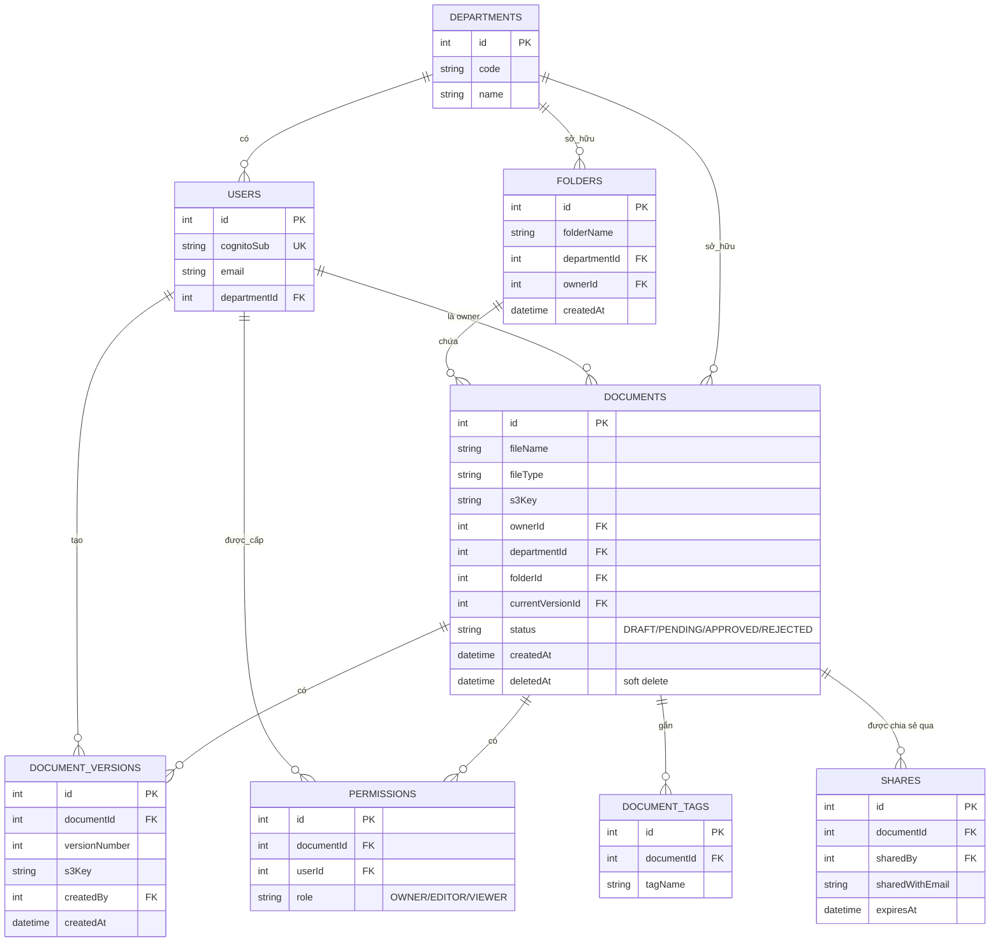

# EDMS — Enterprise Document Management System

Hệ thống quản lý tài liệu doanh nghiệp, xây dựng hoàn toàn theo kiến trúc **Serverless trên AWS**, backend **100% Java 17**.

> ⚠️ **QUAN TRỌNG — đọc trước khi code:** Tài liệu kiến trúc (mục 2-3 dưới đây) đã cập nhật sang thiết kế **v2 (hybrid Aurora Serverless v2 + DynamoDB)**. Tuy nhiên **code Java trong `java/functions/` vẫn đang ở thiết kế v1 (toàn bộ DynamoDB)** — chưa được migrate sang Aurora/RDS Data API. Đây là khoảng cách có chủ đích cần team quyết định rõ trước Weekend 1: xem checklist mục 1.5 trong `EDMS-Master-Checklist.md` để chọn hướng đi (migrate thật hay giữ DynamoDB đã chạy + trình bày Aurora như kiến trúc mục tiêu trong báo cáo).

---

## 1. Giới thiệu đề tài

### Bối cảnh

Doanh nghiệp vừa và nhỏ hiện quản lý tài liệu nội bộ (hợp đồng, hồ sơ nhân sự, báo cáo phòng ban...) rời rạc qua email, Google Drive cá nhân hoặc file server on-premise, dẫn tới: không kiểm soát được ai truy cập tài liệu nào, không có quy trình phê duyệt trước khi công bố, chi phí hạ tầng cố định dù tải sử dụng không đều, khó audit lại lịch sử thao tác.

### Mục tiêu

EDMS giải quyết các vấn đề trên bằng một hệ thống serverless: tự động scale theo tải, trả tiền theo mức sử dụng thực tế, tách biệt rõ ràng giữa lưu trữ – metadata – xử lý nghiệp vụ – thông báo – audit log.

| #  | Mục tiêu                                                            |
| -- | --------------------------------------------------------------------- |
| O1 | Xác thực an toàn qua Cognito, phân quyền theo phòng ban         |
| O2 | Upload/tải xuống tài liệu nhanh, an toàn, không lộ credentials |
| O3 | Quy trình phê duyệt tài liệu trước khi công bố nội bộ      |
| O4 | Chia sẻ tài liệu có kiểm soát thời gian (link hết hạn)       |
| O5 | Dashboard thống kê theo phòng ban phục vụ quản lý              |
| O6 | Toàn bộ hạ tầng là Infrastructure as Code, CI/CD tự động      |
| O7 | Chi phí vận hành tối thiểu khi không có traffic (idle ≈ $0)   |

### 14 chức năng chính

Đăng nhập (Cognito) · Upload tài liệu (S3) · Lưu metadata (DynamoDB) · Danh sách tài liệu · Tạo thư mục · Chia sẻ tài liệu · Thông báo (SNS) · Ghi log (CloudWatch) · Chia sẻ bằng link có thời hạn (Pre-signed URL) · Tìm kiếm theo tên/loại · Dashboard thống kê theo phòng ban · Gắn thẻ (tags) · Quy trình phê duyệt (Step Functions) · CI/CD (GitHub Actions + AWS SAM)

> Chi tiết kiến trúc, sơ đồ luồng, lý do chọn từng dịch vụ: xem `EDMS-Serverless-Roadmap.md`.
> Kế hoạch thời gian, phân vai trò, task theo tuần: xem `EDMS-Master-Checklist.md`.

---

## 2. Công nghệ sử dụng (Tech Stack)

> **Kiến trúc v2:** nâng cấp từ DynamoDB-only sang **hybrid Aurora Serverless v2 (quan hệ) + DynamoDB (audit log)**, bổ sung Edge & Security (CloudFront + WAF) và Cross-cutting Services (Secrets Manager, X-Ray, Lambda Layers). Chi tiết đầy đủ + sơ đồ: mục 2 trong `EDMS-Serverless-Roadmap.md`.

### AWS Services (15 dịch vụ)

| Dịch vụ                                             | Vai trò                                                                   |
| ----------------------------------------------------- | -------------------------------------------------------------------------- |
| **Amazon Cognito**                              | Xác thực & phân quyền (User Pool + Groups theo phòng ban)             |
| **Amazon CloudFront**                           | CDN cho frontend, HTTPS free qua ACM                                       |
| **AWS WAF**                                     | Chặn bot/spam/rate-limit ở edge                                          |
| **Amazon S3**                                   | Lưu trữ file gốc, pre-signed URL, versioning, lifecycle rule            |
| **Aurora Serverless v2 (MySQL) + RDS Data API** | Metadata quan hệ: Documents, Versions, Folders, Permissions, Tags, Shares |
| **Amazon DynamoDB**                             | AuditLog (write-heavy, append-only, TTL)                                   |
| **AWS Lambda**                                  | Business logic (9 function, Java 17)                                       |
| **Amazon API Gateway**                          | Cổng API, tích hợp Cognito Authorizer                                   |
| **AWS Step Functions**                          | Điều phối quy trình phê duyệt tài liệu                             |
| **Amazon SNS**                                  | Thông báo (email) khi có sự kiện duyệt/chia sẻ                      |
| **Amazon EventBridge**                          | Event bus (S3→Lambda) + Scheduled rule (soft-delete cleanup)              |
| **AWS Secrets Manager**                         | Quản lý credential Aurora, tự động xoay vòng                         |
| **Amazon CloudWatch**                           | Log, Metric, Alarm, Dashboard                                              |
| **AWS X-Ray**                                   | Distributed tracing (API GW → Lambda → Aurora/DynamoDB)                  |
| **AWS Lambda Layers**                           | Chia sẻ code Java dùng chung giữa 9 function                            |
| **AWS IAM**                                     | Phân quyền least-privilege, không hard-code key                         |

### Ngôn ngữ & Framework

| Thành phần           | Công nghệ                                                                      |
| ---------------------- | -------------------------------------------------------------------------------- |
| Backend (Lambda)       | **Java 17** (Amazon Corretto), AWS SDK v2 (bao gồm `rds-data`), Jackson |
| Data access (Aurora)   | **RDS Data API** — gọi HTTPS, KHÔNG cần Lambda chạy trong VPC         |
| Build tool             | **Maven** (đóng gói fat-jar bằng `maven-shade-plugin`)               |
| Infrastructure as Code | **AWS SAM** (`template.yaml`)                                            |
| Frontend               | **React 18** + `amazon-cognito-identity-js`                              |
| CI/CD                  | **GitHub Actions** (xác thực qua OIDC, không dùng static AWS key)      |
| Unit test              | **JUnit 5** + **Mockito**                                            |

> ⚠️ **Lưu ý chi phí:** Aurora Serverless v2 không scale về $0 khi idle (tối thiểu 0.5 ACU luôn tính phí, ~$40-60/tháng nếu để chạy cả tháng). Bắt buộc `stop`/xoá cluster giữa các buổi làm việc — chi tiết mục 10 trong `EDMS-Serverless-Roadmap.md`.

---

## 3. Mô hình dữ liệu (ERD)

Kiến trúc v2 dùng **polyglot persistence**: dữ liệu có quan hệ FK phức tạp (Document/Version/Permission/Tag) đưa vào **Aurora Serverless v2 (MySQL, schema 3NF chuẩn)**; dữ liệu ghi liên tục không cần JOIN (AuditLog) giữ ở **DynamoDB**.



**DynamoDB `AuditLog`** (tách riêng, KHÔNG có quan hệ FK, chỉ để ghi/tra cứu theo `documentId`):

| Attribute       | Type                                          | Ghi chú         |
| --------------- | --------------------------------------------- | ---------------- |
| `PK`          | `DOC#<documentId>`                          |                  |
| `SK`          | `LOG#<timestamp>`                           |                  |
| `action`      | `UPLOAD/VIEW/DOWNLOAD/DELETE/APPROVE/SHARE` |                  |
| `performedBy` | Cognito`sub`                                |                  |
| `ttl`         | epoch                                         | Tự xoá log cũ |

> Schema SQL đầy đủ (CREATE TABLE, FK constraint, index): mục 2.3 trong `EDMS-Serverless-Roadmap.md`.

---

## 4. Cấu trúc thư mục

```
edms-serverless/
├── template.yaml                      # AWS SAM - toàn bộ hạ tầng, mọi Lambda Runtime: java17
├── java/functions/<ten_ham>/
│   ├── pom.xml                        # Maven, đóng gói fat-jar bằng maven-shade-plugin
│   └── src/main/java/com/edms/functions/<tenham>/App.java
│   └── src/test/java/.../AppTest.java # JUnit 5 + Mockito
├── statemachine/approval.asl.json     # Step Functions definition (luồng phê duyệt)
├── tests/integration/                 # bash script, chạy trên môi trường dev thật sau khi deploy
├── .github/workflows/deploy.yml       # CI/CD: mvn test từng module -> sam build -> sam deploy (OIDC)
├── frontend/                          # React SPA
└── src/functions/_python_reference_unused/   # bản Python gốc (KHÔNG deploy), chỉ để đối chiếu logic
```

**9 Lambda function (đều Java 17):**

| Function                                               | Package                               |
| ------------------------------------------------------ | ------------------------------------- |
| `upload_init`                                        | `com.edms.functions.uploadinit`     |
| `document_crud` (2 handler: CRUD + trigger approval) | `com.edms.functions.documentcrud`   |
| `list_documents`                                     | `com.edms.functions.listdocuments`  |
| `folder_mgmt`                                        | `com.edms.functions.foldermgmt`     |
| `search`                                             | `com.edms.functions.search`         |
| `share_link`                                         | `com.edms.functions.sharelink`      |
| `approval_tasks`                                     | `com.edms.functions.approvaltasks`  |
| `notify`                                             | `com.edms.functions.notify`         |
| `dashboard_stats`                                    | `com.edms.functions.dashboardstats` |

---

## 5. Cài đặt & Setup

### 5.1 Yêu cầu công cụ

- **JDK 17** (khuyến nghị Amazon Corretto 17)
- **Maven 3.8+**
- **AWS SAM CLI** ≥ 1.100 (bản cài standalone đã bundle sẵn Python riêng cho chính nó — không cần cài Python thủ công)
- **AWS CLI v2**
- `jq` (dùng trong script integration test)
- Git

### 5.2 Setup một lần duy nhất (one-time, làm 1 lần cho cả nhóm)

#### A. Tài khoản AWS & bảo mật (~15 phút)

- [ ] Tạo tài khoản AWS chung, bật **MFA cho root user** ngay lập tức
- [ ] Tạo **Billing Alarm**: Billing Console → Budgets → cảnh báo email khi chi phí > $5
- [ ] Tạo **1 IAM user riêng cho mỗi thành viên** (KHÔNG dùng chung 1 key, KHÔNG ai dùng root)

#### B. Cài công cụ & cấu hình AWS CLI

```bash
aws configure
# Access Key/Secret của IAM user riêng mình (không phải root)
aws sts get-caller-identity   # verify: phải ra đúng user của mình, KHÔNG phải root
```

#### C. Tạo GitHub repo chung

```bash
# Tạo repo, thêm collaborator, push code lên nhánh main, tạo thêm nhánh develop
```

#### D. Build & deploy hạ tầng lần đầu

```bash
# 1. Build thử từng module Java trước (bắt lỗi compile sớm)
for dir in java/functions/*/; do (cd "$dir" && mvn -q clean package); done

# 2. Build & deploy toàn bộ stack
sam build
sam deploy --guided --capabilities CAPABILITY_IAM
# Trả lời prompt: stack-name=edms-dev, region=ap-southeast-1, Stage=dev
```

Lưu lại **Outputs**: `ApiUrl`, `UserPoolId`, `UserPoolClientId`, `BucketName`, `TableName`, `SnsTopicArn`.

#### E. Cognito Groups theo phòng ban

```bash
aws cognito-idp create-group --group-name SALES --user-pool-id <UserPoolId>
aws cognito-idp create-group --group-name HR --user-pool-id <UserPoolId>
```

#### F. SNS subscription chung

```bash
aws sns subscribe --topic-arn <SnsTopicArn> --protocol email --notification-endpoint <email-nhom>@gmail.com
```

#### G. IAM Role cho GitHub Actions OIDC + Secrets

```bash
aws iam create-role --role-name github-actions-deploy-role \
  --assume-role-policy-document file://trust-policy-oidc.json
aws iam attach-role-policy --role-name github-actions-deploy-role \
  --policy-arn arn:aws:iam::aws:policy/PowerUserAccess
```

(Chi tiết `trust-policy-oidc.json`: mục 7.3 trong `EDMS-Serverless-Roadmap.md`)
Vào GitHub repo → Settings → Secrets → thêm `AWS_DEPLOY_ROLE_ARN`. **Không lưu `AWS_ACCESS_KEY_ID`/`AWS_SECRET_ACCESS_KEY` ở bất kỳ đâu.**

> Danh sách công việc dạng checkbox chi tiết (để track theo từng người/từng tuần): xem `EDMS-Master-Checklist.md`.

### 5.3 Chạy test

```bash
# Unit test (JUnit 5 + Mockito, không cần deploy, không tốn tiền)
for dir in java/functions/*/; do (cd "$dir" && mvn test); done

# Integration test (CẦN đã deploy xong)
export API_URL="<ApiUrl từ Outputs>"
export USER_POOL_CLIENT_ID="<UserPoolClientId từ Outputs>"
export TABLE_NAME="<TableName từ Outputs>"
export TEST_EMAIL="test@edms.vn"
export TEST_PASSWORD="Passw0rd!"
bash tests/integration/test_e2e_upload.sh
```

### 5.4 Lưu ý quan trọng khi dùng Java

- **Cold start chậm hơn Python** (~1-3s so với ~300ms) — nếu demo trực tiếp, gọi "khởi động ấm" (invoke thử 1 lần) từng function trước khi trình bày.
- Muốn tối ưu, có thể bật **Lambda SnapStart** (chỉ Java mới có, snapshot sẵn JVM đã init):
  ```yaml
  SnapStart:
    ApplyOn: PublishedVersions
  AutoPublishAlias: live
  ```
- Mỗi function là 1 Maven project độc lập (không dùng parent POM chung) — đơn giản, dễ hiểu, đổi lại phải lặp dependency ở vài `pom.xml`.
- `document_crud` có **2 handler trong cùng 1 class** (`handleRequest` và `handleTriggerApproval`) — SAM khai báo 2 Resource khác nhau nhưng dùng chung `CodeUri`.

### 5.5 Dọn dẹp tài nguyên (sau khi nộp bài xong)

Chi tiết đầy đủ + checklist xác nhận $0 cost: mục 9 trong `EDMS-Serverless-Roadmap.md`. Tóm tắt:

```bash
aws s3 rm s3://edms-docs-<account-id>-dev --recursive
sam delete --stack-name edms-dev --no-prompts
aws cognito-idp delete-user-pool --user-pool-id <POOL_ID>
```

---

## Tài liệu liên quan

| File                           | Nội dung                                                                                   |
| ------------------------------ | ------------------------------------------------------------------------------------------- |
| `EDMS-Serverless-Roadmap.md` | Kiến trúc đầy đủ, sơ đồ, lý do chọn dịch vụ, bảo mật, clean-up chi tiết     |
| `EDMS-Master-Checklist.md`   | Quyết định phạm vi, phân vai trò, lộ trình học, checklist task theo tuần, rủi ro |

*Ghi chú: `EDMS-Serverless-Roadmap.md` được viết trước khi quyết định chuyển hẳn sang Java — các đoạn code mẫu trong đó là Python nhưng logic nghiệp vụ mô tả vẫn đúng 100%, đối chiếu sang file Java tương ứng trong `java/functions/`.*
