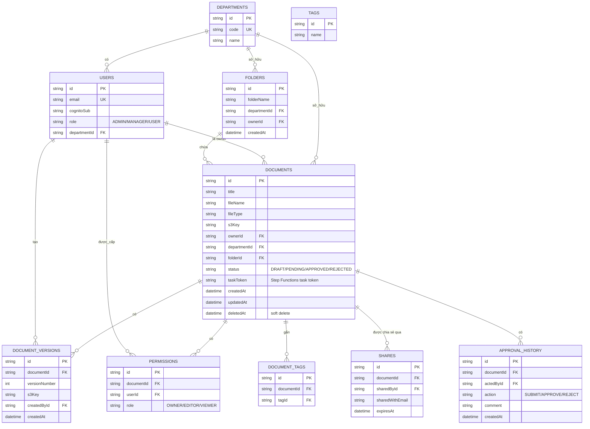

# EDMS — Enterprise Document Collaboration Platform

Hệ thống quản lý & cộng tác tài liệu doanh nghiệp (Enterprise Document Management System), xây dựng theo kiến trúc **Serverless trên AWS**. Backend **Spring Boot (Java 17)** đóng gói thành **1 Lambda monolith**, frontend **React 18** host trên **Amplify**, cơ sở dữ liệu **Aurora MySQL**.

> **Trạng thái:** ✅ Đã triển khai & chạy trên AWS (API Gateway + Lambda + Aurora + S3 + Cognito + Step Functions + SNS + Amplify), CI/CD tự động qua GitHub Actions + SAM.

---

## 1. Giới thiệu đề tài

### Bối cảnh

Doanh nghiệp vừa và nhỏ quản lý tài liệu nội bộ (hợp đồng, hồ sơ nhân sự, báo cáo phòng ban...) rời rạc qua email, Google Drive cá nhân hoặc file server on-premise, dẫn tới: không kiểm soát được ai truy cập tài liệu nào, không có quy trình phê duyệt trước khi công bố, chi phí hạ tầng cố định dù tải sử dụng không đều, khó audit lại lịch sử thao tác.

### Mục tiêu

EDMS giải quyết các vấn đề trên bằng một hệ thống serverless: tự động scale theo tải, trả tiền theo mức sử dụng thực tế, tách biệt rõ ràng giữa lưu trữ – metadata – xử lý nghiệp vụ – thông báo – audit log.

| #  | Mục tiêu                                                          |
| -- | ------------------------------------------------------------------ |
| O1 | Xác thực an toàn qua Cognito, phân quyền theo vai trò (ADMIN/MANAGER/USER) |
| O2 | Upload/tải xuống tài liệu nhanh, an toàn, không lộ credentials |
| O3 | Quy trình phê duyệt tài liệu trước khi công bố nội bộ      |
| O4 | Chia sẻ tài liệu có kiểm soát (phân quyền OWNER/EDITOR/VIEWER) |
| O5 | Dashboard thống kê theo phòng ban phục vụ quản lý            |
| O6 | Toàn bộ hạ tầng là Infrastructure as Code, CI/CD tự động     |
| O7 | Chi phí vận hành tối thiểu khi không có traffic (idle ≈ $0) |

### Các chức năng chính

Đăng nhập (Cognito) · Upload/tải tài liệu (S3) · Quản lý metadata (Aurora MySQL) · Danh sách tài liệu & thư mục · Tạo thư mục · Phân quyền tài liệu (OWNER/EDITOR/VIEWER) · Quy trình phê duyệt qua **Step Functions** (submit/approve/reject + waitForTaskToken) · Thông báo email (SNS) · Quản lý phiên bản tài liệu (version + rollback) · Gắn thẻ (tags) · Tìm kiếm theo tên/loại · Chia sẻ bằng link · Dashboard thống kê · Quản lý người dùng & phòng ban · **OCR** trích xuất văn bản · Ghi audit log (CloudWatch) · CI/CD (GitHub Actions + AWS SAM)

> Kiến trúc, sơ đồ luồng, lý do chọn dịch vụ: `EDMS-Serverless-Roadmap.md`.
> Kế hoạch thời gian, phân vai trò, task theo tuần: `EDMS-Master-Checklist.md`.

---

## 2. Công nghệ sử dụng (Tech Stack)

### AWS Services (10 dịch vụ đang dùng)

| Dịch vụ                              | Vai trò                                                              |
| -------------------------------------- | ---------------------------------------------------------------------- |
| **Amazon Cognito**               | Xác thực & phân quyền (User Pool + Groups ADMIN/MANAGER/USER)     |
| **Amazon S3**                    | Lưu trữ file gốc, pre-signed URL                              |
| **Aurora MySQL**                 | Metadata quan hệ: Users, Departments, Documents, Versions, Folders, Permissions, Tags, Shares, ApprovalHistory, AuditLog, OcrResult |
| **AWS Lambda**                   | Chạy Spring Boot backend monolith (Java 17, fat-jar)              |
| **Amazon API Gateway**           | Cổng REST API, tích hợp Lambda Proxy                              |
| **AWS Step Functions**           | **Orchestrate quy trình phê duyệt** (waitForTaskToken, Choice, SNS publish) |
| **Amazon SNS**                   | Thông báo email khi có sự kiện duyệt tài liệu (approve/reject) |
| **Amazon CloudWatch**            | Log & monitoring Lambda                                            |
| **AWS Amplify**                  | Hosting frontend React (HTTPS)                                     |
| **AWS IAM**                      | Phân quyền least-privilege, OIDC cho CI/CD, không hard-code key |

### Ngôn ngữ & Framework

| Thành phần                 | Công nghệ                                                              |
| ---------------------------- | ----------------------------------------------------------------------- |
| Backend (Lambda)             | **Java 17** (Spring Boot 3.2.x), Spring Web, Spring Data JPA, Spring Security, AWS SDK v2 (s3, cognito-idp, sns, sfn) |
| Data access (Aurora)         | **Spring Data JPA** (Hibernate) — driver JDBC MySQL                      |
| Build tool                   | **Maven** (Spring Boot plugin + `maven-shade-plugin`)                    |
| Infrastructure as Code       | **AWS SAM** (`template.yaml`) + **CloudFormation**                     |
| Frontend                     | **React 18** + `amazon-cognito-identity-js` + React Router + Axios      |
| CI/CD                        | **GitHub Actions** (xác thực qua OIDC, không dùng static AWS key)      |
| Unit test                    | **JUnit 5** + **Mockito** (MVC Test)                                   |
| Bảo mật API                  | JWT (Cognito), `@PreAuthorize` theo role, phân quyền tài liệu theo PermissionRole |

> **Lưu ý:** Kết nối Aurora dùng JDBC (Lambda phải chạy trong VPC cùng Security Group của Aurora) — không dùng RDS Data API.

---

## 2.1 Kiến trúc hệ thống

Sơ đồ kiến trúc tổng thể của EDMS (Cloud-Native Serverless) trên AWS:


> File thiết kế gốc (editable): `Architecture Overview-EDMS - Kiến trúc Cloud-Native Serverless.drawio.xml`.

---

## 3. Mô hình dữ liệu (ERD)

Hệ thống dùng **1 cơ sở dữ liệu quan hệ Aurora MySQL** (schema chuẩn hóa) — mọi dữ liệu metadata đều ở đây.



> Schema SQL đầy đủ: `backend/src/main/resources/db/migration/V1__init_schema.sql` + `db/mysql-setup.sql`; seed data: `backend/src/main/resources/data.sql`.

---

## 3.1 Quy trình phê duyệt (AWS Step Functions)

Quy trình phê duyệt tài liệu được **điều phối bởi AWS Step Functions** (state machine `DocumentApprovalStateMachine`) — đúng pattern *human approval* với **waitForTaskToken**:

```
USER submit ──▶ Lambda: startExecution({documentId})
                     │
                     ▼
  [CaptureToken: Task .waitForTaskToken] ── Lambda lưu task token vào DB, treo chờ
                     │           chờ SendTaskSuccess / SendTaskFailure
                     ▼
        [Decision: Choice]
        APPROVED │            │ REJECTED
                ▼            ▼
        [MarkApproved]  [MarkRejected]   (Lambda cập nhật DB status + history)
                │            │
                ▼            ▼
        [NotifyApproved] [NotifyRejected] (Step Functions → SNS: publish email)
                └───── End ─────┘
```

**Luồng thực thi:**

1. **Submit** — API `/approval/submit` → Lambda set `PENDING` + `startExecution` lên Step Functions.
2. **CaptureToken** — state `CaptureToken` (`.waitForTaskToken`) invoke Lambda lưu `task_token` vào bảng `documents`, rồi **treo** chờ quyết định của người duyệt (có thể chờ lâu không giới hạn — vượt qua timeout 15 phút của Lambda).
3. **Approve/Reject** — API gọi `SendTaskSuccess(token, {decision, actedBy, reason})` → state machine "thức dậy".
4. **Choice** — rẽ nhánh theo `decision`.
5. **MarkStatus** — Step Functions invoke Lambda (`/internal/workflow`) cập nhật DB `status = APPROVED/REJECTED` + ghi lịch sử.
6. **Notify** — Step Functions trực tiếp gọi **SNS publish** để gửi email thông báo.

> Ưu điểm so với xử lý inline trong Lambda: quy trình có **lịch sử execution rõ ràng** (dễ trace/audit), có thể **chờ con người duyệt không giới hạn**, mỗi bước đều **retry/kiểm soát lỗi**, và được trực quan hóa trong AWS Console (Step Functions → State machines → Graph view).

---

## 4. Cấu trúc thư mục

```
Enterprise-Document-Collaboration-Platform/
├── backend/                            # Spring Boot backend (Java 17)
│   ├── pom.xml                         # Maven build, đóng gói fat-jar
│   ├── template.yaml                   # AWS SAM - hạ tầng serverless (1 Lambda)
│   └── src/
│       ├── main/java/com/edms/
│       │   ├── EdmsApplication.java    # Spring Boot entrypoint
│       │   ├── StreamLambdaHandler.java # AWS Lambda adapter (API Gateway + Step Functions events)
│       │   ├── api/                    # REST Controllers + DTO + Exception (tầng giao tiếp)
│       │   ├── application/            # Use cases (services) + ports (interfaces)
│       │   ├── domain/                 # Entities + enums + domain events
│       │   └── infrastructure/         # AWS adapters + persistence + security + config
│       └── main/resources/
│           ├── application.yml         # config chung
│           ├── application-aws.yml     # config profile aws (Lambda)
│           ├── application-mysql.yml   # config profile mysql (local)
│           ├── data.sql                # seed data (18 users, docs, permissions)
│           └── db/migration/           # Flyway schema (V1__init_schema.sql, V2__add_task_token.sql)
├── frontend/                           # React 18 SPA
│   └── src/
│       ├── api/                        # axios + auth api (Cognito)
│       ├── components/                 # Layout, ProtectedRoute, ShareModal,...
│       ├── context/                    # AuthContext
│       └── pages/                      # Login, Dashboard, Document, Folder, Admin...
├── .github/workflows/deploy.yml        # CI/CD: test -> build -> SAM deploy (OIDC)
├── postman/ .postman/                  # Postman collections
└── .env                                # (local only, bị .gitignore - không commit)
```

### Kiến trúc backend (Hexagonal / Ports & Adapters)

| Package             | Vai trò                                                        |
| -------------------- | --------------------------------------------------------------- |
| `api/controller`   | REST endpoints: Auth, Document, Folder, Version, Permission, Share, Tag, Search, Approval, Dashboard, User, Department, Upload, OCR + `WorkflowInternalController` (Step Functions callback) |
| `api/dto`          | Request/Response objects                                         |
| `api/exception`    | Global exception handler + custom exceptions                     |
| `application/ports`| Interfaces: Authentication, Storage, Notification, Workflow, Audit, Ocr, SecretProvider, EventPublisher |
| `application/service` | Application use cases (business logic orchestration)          |
| `domain`           | Entities, enums (UserRole, PermissionRole, DocumentStatus, ApprovalAction...), domain events |
| `infrastructure/aws`  | AWS adapters: Cognito auth/JWT, S3 storage, SNS notification, **Step Functions workflow** |
| `infrastructure/adapters/local` | Local mocks cho dev (mysql profile)               |
| `infrastructure/persistence` | JPA entities + repositories                          |
| `infrastructure/security` | JWT filter, Spring Security config, token validation           |

**2 profile chạy:**
- `aws` (Lambda trên AWS): Cognito + S3 + SNS + **Step Functions** + Aurora (`StepFunctionsWorkflowService`)
- `mysql` (local dev): mọi adapter AWS thay bằng mock local (`LocalWorkflowService`), dùng MySQL local

---

## 5. Cài đặt & Setup

### 5.1 Yêu cầu công cụ

- **JDK 17** (Amazon Corretto 17)
- **Maven 3.8+**
- **AWS SAM CLI** ≥ 1.100
- **AWS CLI v2**
- **Node.js 18+** + npm
- **MySQL** (cho chạy local) hoặc chỉ cần Aurora trên AWS
- Git

### 5.2 Chạy Backend local (profile mysql)

```bash
cd backend
# Cấu hình biến môi trường trong .env (root) hoặc export trực tiếp
export DB_PASS=<mat-khau-mysql-local>
mvn spring-boot:run   # API chạy tại http://localhost:8088
```

### 5.3 Chạy Frontend local

```bash
cd frontend
cp .env.example .env  # nếu có, hoặc tạo .env với COGNITO + API_URL
npm install
npm start             # chạy tại http://localhost:3000
```

### 5.4 Chạy test

```bash
cd backend
mvn test              # JUnit 5 + Mockito + MVC Test (14 test cases)
```

### 5.5 Deploy lên AWS (CI/CD)

Hệ thống deploy tự động bằng **GitHub Actions** khi push lên nhánh `main`:

1. `test-backend` → `mvn test`
2. `build-frontend` → `npm ci && npm run build`
3. `deploy` → OIDC assume role → `sam deploy` (stack `edms-lambda-stack`)

> Frontend build được đẩy lên **AWS Amplify** tự động. API Gateway endpoint: `https://x0ozqn01t0.execute-api.ap-southeast-1.amazonaws.com/Prod/`.

### 5.6 Các AWS Resource đã triển khai

| Resource                    | Giá trị                                                                 |
| ---------------------------- | ------------------------------------------------------------------------- |
| API Gateway (Prod)          | `x0ozqn01t0.execute-api.ap-southeast-1.amazonaws.com`                    |
| Lambda                      | `edms-lambda-stack` (Spring Boot monolith, Java 17)                      |
| Aurora MySQL                | `edms.cluster-cvgu2ei6wy4r.ap-southeast-1.rds.amazonaws.com` (DB `edms`) |
| S3 bucket                   | `edms-docs-bucket-319602346700-ap-southeast-1-an`                        |
| Cognito User Pool           | `ap-southeast-1_QCwP39T1z` (client `2793dbk113fvr5eq61fkkl1432`)        |
| SNS topic                   | `edms-notifications` (email notification)                                |
| Step Functions              | `DocumentApprovalStateMachine` (orchestrate approval workflow)           |
| Amplify                     | `main.d3o9he2i74kozn.amplifyapp.com`                                     |
| CloudFormation stack        | `edms-lambda-stack`                                                      |

> ⚠️ **Bảo mật:** Các credentials (AWS key, DB password) nằm trong `.env` và GitHub Secrets, **không bao giờ commit lên git**. SAM template chỉ dùng `${ENV_VAR}` placeholders.

---

## Tài liệu liên quan

| File                           | Nội dung                                                                        |
| ------------------------------ | --------------------------------------------------------------------------------- |
| `EDMS-Serverless-Roadmap.md`   | Kiến trúc đầy đủ, sơ đồ, lý do chọn dịch vụ, bảo mật, clean-up chi tiết |
| `EDMS-Master-Checklist.md`     | Quyết định phạm vi, phân vai trò, lộ trình học, checklist task theo tuần, rủi ro |
| `backend/Contract-backend.md`  | Chi tiết REST API backend                                                          |
| `frontend/API-CONTRACT.md`     | Chi tiết API contract phía frontend                                                |
| `AWS-COGNITO-REQUIREMENTS.md`  | Yêu cầu cấu hình Cognito (User Pool, Groups, Clients)                           |
